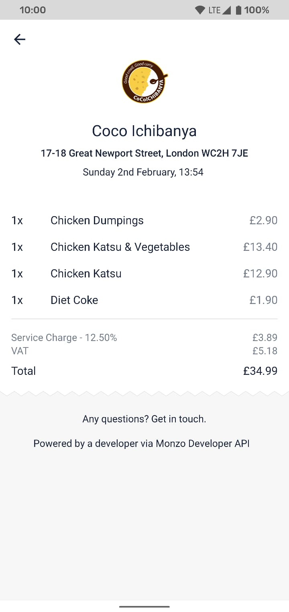
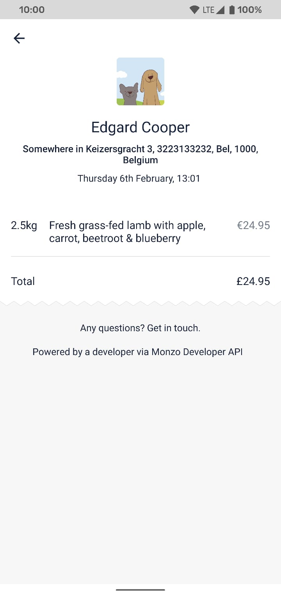
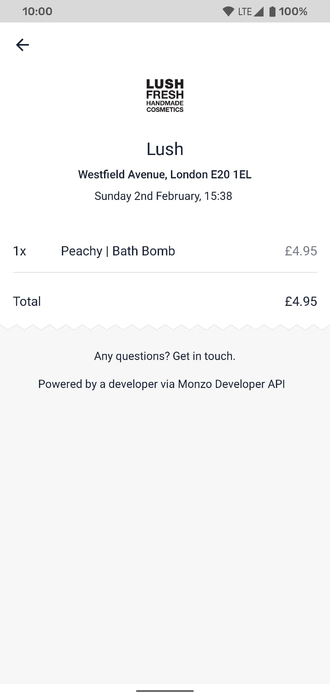
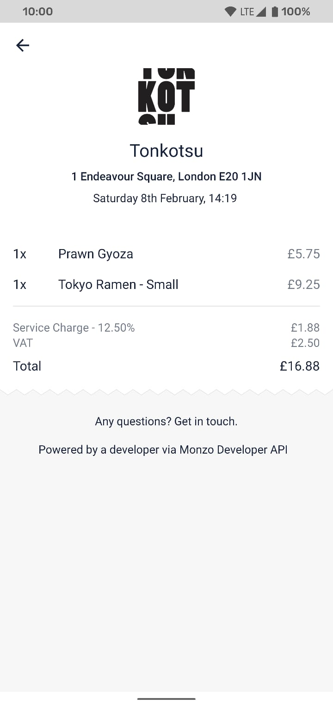

Manual Monzo Receipt Generator
=========

Third party client that attaches receipts to Monzo transcations using the Receipts API

## Note
This client API project is based on the [reference receipts app](https://github.com/monzo/reference-receipts-app) example by Monzo and most of the code comes from said example.

## Getting Started
You'll need a Monzo account to register and manage your OAuth2 API clients. If you don't yet have a Monzo account, you can [open an account](https://monzo.com) on your phone now -- it takes no more than a few minutes with an ID on hand. Search for `Monzo` in either the App Store or Google Play Store.

To register your API client, head to [developers.monzo.com](http://developers.monzo.com), and select `Sign in with your Monzo account`. You'll receive an email sign in link, as the Developers Portal itself is an OAuth application. Once you've logged in, go to `Client`, and click on `New OAuth Client`. You'll need to provide the following information to register a client:

* **Name**: The name of your application. Users see it when redirected to auth.monzo.com to Sign in.
* **Logo URL**: A link to the logo image of your application, although this is not currently displayed.
* **Redirect URLs**: The callback URLs to the application. In this example application, a callback is not actually handled, and only parse the temporary auth code returned. Therefore you'll need to use use a fake local URL of `http://127.0.0.1:21234/`. A real application will ideally handle auth flows automatically, and an internet-accessible callback endpoint will be needed here instead.
* **Description**: A short description on the purpose of the application. Feel free to put anything here.
* **Confidentiality**: A confidential API client will keep the OAuth2 secret from a user, and hence will be allowed to [refresh](https://docs.monzo.com/#refreshing-access) access tokens with a refresh token. While a non-confidential client may expose its OAuth2 secrets to the client, such as embedded in the JavaScript of a web application. As the client will be kept locally for now, feel free to set it as `Confidential` here.

Once you have registered the API client, you will have received a Client ID and a Client Secret. The next step is to clone this repository:
```
git clone https://github.com/Skyth3r/Manual-Receipt-Generator.git
cd Manual-Receipt-Generator
```

Now we need to configure the client:
```
cp config-example.py config.py
```
And edit `config.py` with your favourite editor to set `MONZO_CLIENT_ID` and `MONZO_CLIENT_SECRET`. 

The example client is written in Python 3. You will ideally need Python3.6 and `pip`. We need to install some dependencies, preferably in a virtual environment. We will be using `pipenv` in this example:
```
pipenv shell
pipenv install -r requirements.txt
```

## Usage
The client should now be ready to use. To use the client to generate a receipt, edit the `payload.json` file to contaction the details for the receipt. You'll need to obtain the transaction_id of the transaction you want to generate this receipt for. You can either obtain this by accessing your transcations via the developer API and [listing the transcations](https://docs.monzo.com/#retrieve-transaction) on your account or you can obtain this via the [API Playground](https://developers.monzo.com/).

Once this is done, simply run:
```
python main.py
```
And follow the authentication flow as prompted.

The client will add the receipt data provided by the `payload.json` file and attempt to generate and attach a receipt to the transaction linked to the transaction_id in `payload.json`.

## Example Generated Receipts





## Extending the Application
This API client is very basic: it requires you to provide a single json file to generate a receipt. It does not source receipt data from elsewhere, and does not run a server to accept webhook calls from Monzo and thus does not add receipts to new transactions as they pop up.

